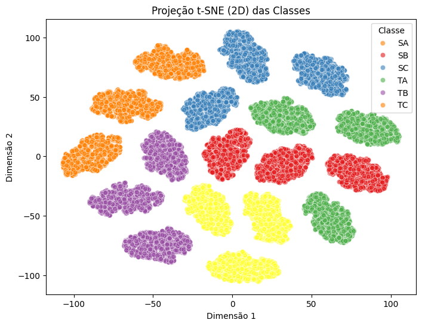

# Projeto: Classificação de Plantas em Estufas IoT e Tradicionais

*Área Temática:* Biotecnologia
*Tema:* Classificação de plantas cultivadas em estufas com e sem monitoramento por IoT utilizando análise multivariada de parâmetros fisiológicos.

## Contexto

A agricultura de precisão, apoiada por sistemas de Internet das Coisas (IoT), possibilita o monitoramento contínuo do desenvolvimento vegetal. Esse projeto busca comparar plantas cultivadas em estufas IoT (com sensores inteligentes) e estufas tradicionais (medições manuais), identificando padrões fisiológicos que diferenciam os dois sistemas.

## Dataset

*Nome:* Advanced IoT Agriculture Dataset
*Origem:* Tikrit University – Agriculture Lab (Iraque, 2023–2024)
*Tamanho:* 30.000 registros
*Variáveis:* 14 atributos fisiológicos + rótulo de classe

| Coluna | Descrição                                                       |
| ------ | --------------------------------------------------------------- |
| ACHP   | Clorofila média (pigmentação fotossintética)                    |
| PHR    | Taxa de crescimento em altura                                   |
| ALAP   | Área foliar média                                               |
| ANPL   | Número médio de folhas                                          |
| ARD    | Diâmetro radicular                                              |
| ARL    | Comprimento radicular                                           |
| AWWGV  | Peso úmido vegetativo                                           |
| ADWV   | Peso seco vegetativo                                            |
| PDMVG  | % matéria seca vegetativa                                       |
| AWWR   | Peso úmido radicular                                            |
| ADWR   | Peso seco radicular                                             |
| PDMRG  | % matéria seca radicular                                        |
| Random | ID de amostra (R1–R3)                                           |
| Class  | Grupo experimental (SA, SB, SC → IoT; TA, TB, TC → Tradicional) |

*Diferencial:* O dataset possibilita avaliar diferenças fisiológicas de plantas sob condições controladas (IoT) versus métodos tradicionais.

## Metodologia

1. *Exploração de dados (EDA):* estatísticas descritivas, histogramas, boxplots e heatmaps.

2. *Projeções multivariadas:* PCA (2D/3D) para visualizar separação entre grupos.

3. *Modelagem preditiva:*

* Logistic Regression
* Random Forest
* XGBoost

Todos atingiram 100% de acurácia, confirmando a distinção clara entre os grupos.

*Interpretabilidade:* análise de importância de variáveis e SHAP values.

## Resultados

* Separação clara entre grupos IoT e tradicionais (clusters isolados nas projeções).

* *Grupos IoT:* maior uniformidade, maior expansão foliar e crescimento em altura.

* *Grupos tradicionais:* maior variabilidade de biomassa e arquitetura radicular.

* *Variáveis-chave:*

* * *PHR* – taxa de crescimento em altura
* * *ALAP* – área foliar média
* * *ARD* – diâmetro radicular

As análises confirmaram que o monitoramento IoT favorece maior vigor e uniformidade fisiológica.

## Conclusão

Este estudo demonstra que variáveis fisiológicas podem atuar como marcadores robustos para diferenciar ambientes de cultivo. A combinação de biotecnologia + IoT + aprendizado de máquina abre caminho para estratégias de manejo mais eficientes, otimizando:

* Eficiência fotossintética
* Uso racional de recursos
* Desempenho agronômico