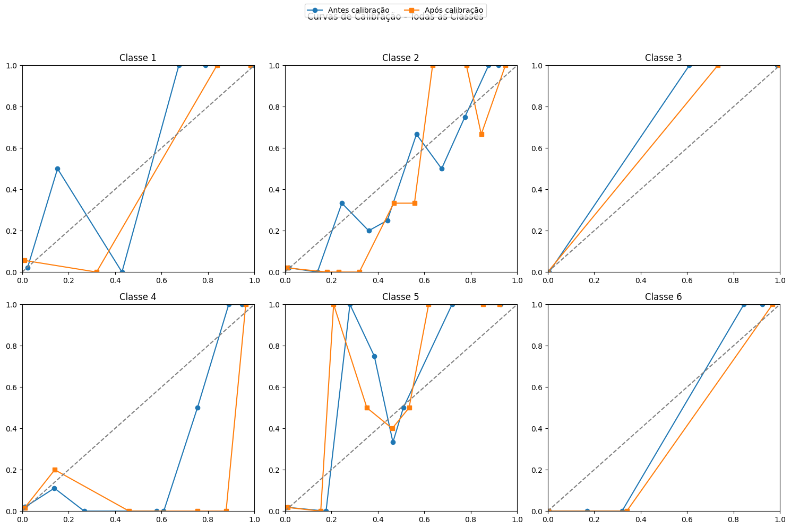

# Projeto: Modelagem Preditiva para Redução de Biópsias no Diagnóstico de Doenças Eritemato-Descamativas  

**Área Temática:** Dermatologia  
**Tema:** Uso de modelos de inteligência artificial para apoiar o diagnóstico clínico e reduzir a necessidade de biópsias em doenças dermatológicas complexas.  

## Contexto  

As doenças eritemato-descamativas (psoríase, dermatite seborreica, líquen plano, pitiríase rósea, dermatite crônica e pitiríase rubra pilar) representam um grande desafio diagnóstico. Isso porque seus sinais e sintomas clínicos são bastante semelhantes e até mesmo as características histopatológicas podem se sobrepor.  

Na prática, o exame de biópsia é considerado o padrão-ouro para confirmação, mas é invasivo, custoso e nem sempre necessário. Nesse cenário, surge a possibilidade de aplicar modelagem preditiva em dados clínicos para indicar situações nas quais a biópsia poderia ser dispensada.  

## Dataset  

**Nome:** *Erythemato-Squamous Diseases Dataset*  
**Amostras:** 366 pacientes  
**Atributos:** 34 (33 numéricos + 1 categórico de classe)  
**Valores ausentes:** 8 (variável Age)  

Estrutura do dataset:  
- **12 variáveis clínicas** (ex.: idade, histórico familiar, eritema, prurido, escamação).  
- **22 variáveis histopatológicas** (avaliadas em microscopia de pele).  
- **Classe:** diagnóstico final → 6 categorias (psoríase, dermatite seborreica, líquen plano, pitiríase rósea, dermatite crônica, pitiríase rubra pilar).  

Valores das variáveis variam de **0 a 3**, representando intensidade ou presença de características clínicas/histológicas.  

## Metodologia  

1. **Pré-processamento**  
   - Tratamento de valores ausentes na variável *Age*.  
   - Normalização das variáveis para equilibrar escalas.  

2. **Modelagem em dois cenários**  
   - **Modelo clínico:** apenas variáveis clínicas, sem histopatologia.  
   - **Modelo completo:** integração de variáveis clínicas + histopatológicas.  

3. **Modelos aplicados**  
   - Regressão Logística  
   - Random Forest  
   - XGBoost  

4. **Estratégia adicional**  
   - **Calibração probabilística (limiar 0,7):** para definir casos em que o modelo clínico poderia dispensar a necessidade de biópsia.  

## Resultados  

- **Modelo clínico:**  
  - Acurácia global = **81%**  
  - Sensibilidade média = **85%**  
  - Especificidade = **97%**  

- **Modelo completo:**  
  - Acurácia = **96%**  

- **Após calibração probabilística (limiar 0,7):**  
  - 72% dos pacientes poderiam ser diagnosticados apenas com dados clínicos.  
  - Acurácia nesses casos = 93%.  

📌 Isso mostra que a aplicação de IA permite um fluxo de decisão em duas etapas:  
1. Casos de alta confiança → diagnóstico clínico sem necessidade de biópsia.  
2. Casos de incerteza → encaminhamento para biópsia.  

As curvas abaixo mostram a melhoria do desempenho após a calibração probabilística aplicada às seis classes de doenças dermatológicas:  

  

## Conclusão  

Este estudo indica que, em um conjunto de 366 pacientes, a utilização de variáveis exclusivamente clínicas, combinadas com calibração probabilística, pode reduzir em aproximadamente quatro quintos a necessidade de biópsias, mantendo desempenho diagnóstico robusto.  

O uso de IA aplicada à dermatologia demonstra potencial para tornar os diagnósticos mais ágeis, menos invasivos e economicamente mais viáveis, com impacto direto na prática clínica e no manejo de pacientes.  
