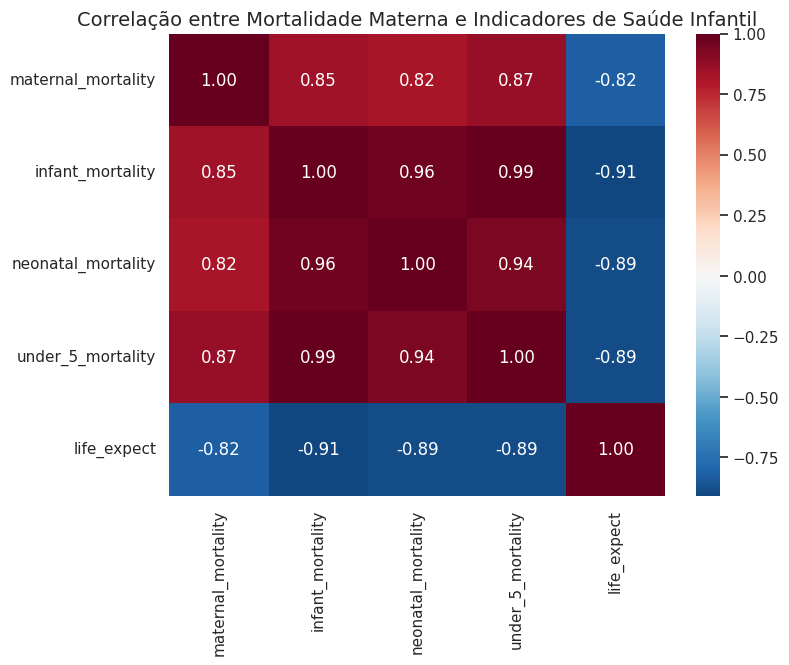

# Projeto: Mortalidade Materna como Indicador da Mortalidade Infantil em Análise Epidemiológica Global  

**Área Temática:** Epidemiologia  
**Tema:** Utilização da mortalidade materna como marcador sentinela para indicadores de saúde infantil em nível global.  

## Contexto  

A mortalidade materna e infantil estão entre os principais indicadores de desenvolvimento humano e refletem a qualidade dos sistemas de saúde. Normalmente analisadas de forma isolada, aqui propomos uma abordagem inovadora: investigar se a mortalidade materna pode atuar como preditor robusto da mortalidade infantil, neonatal, em menores de cinco anos e até mesmo da expectativa de vida.  

Esse estudo foi realizado com base em dados internacionais de 2014 a 2024, abrangendo 167 países em diferentes contextos socioeconômicos.  

## Dataset  

**Nome:** *Global Population & Health Metrics 2014–2024*  
**Registros após limpeza:** 1.106  
**Origem:** Compilação internacional de indicadores populacionais e de saúde.  

### Estrutura do dataset:  
- **Country / Country Code:** país (nome + ISO-3).  
- **Year:** ano (2014–2024).  
- **Population:** população total.  
- **health_exp:** % do PIB gasto em saúde.  
- **life_expect:** expectativa de vida.  
- **maternal_mortality:** mortes maternas por 100.000 NV.  
- **infant_mortality:** mortes de menores de 1 ano por 1.000 NV.  
- **neonatal_mortality:** mortes de 0–28 dias por 1.000 NV.  
- **under_5_mortality:** mortes de menores de 5 anos por 1.000 NV.  
- **prev_hiv:** prevalência de HIV (%).  
- **inci_tuberc:** incidência de tuberculose (100.000 hab).  
- **prev_undernourishment:** % da população subnutrida.  

## Metodologia  

O fluxo de análise seguiu as seguintes etapas:  

1. Limpeza e preparação dos dados: exclusão de registros incompletos e inconsistentes.  
2. Análise exploratória: estatísticas descritivas e visualizações para avaliar tendências globais.  
3. Correlação de Pearson: identificação de associações entre mortalidade materna e outros indicadores.  
4. Modelagem estatística:  
   - Regressão linear simples (mortalidade materna → mortalidade infantil).  
   - Regressão múltipla com ajuste pelo gasto em saúde.  

## Resultados  

Os achados mostraram que a mortalidade materna tem forte associação com os indicadores de saúde infantil:  

- Correlação com **mortalidade infantil:** r = 0,85  
- Correlação com **mortalidade neonatal:** r = 0,82  
- Correlação com **mortalidade em menores de 5 anos:** r = 0,87  
- Correlação negativa com **expectativa de vida:** r = -0,82  

📈 O modelo de regressão simples apresentou R² = 72%, e quando ajustado pelo gasto em saúde, R² = 74%, confirmando o papel protetor do investimento público em saúde.  

Além disso, alguns países destoaram do padrão esperado (ex.: Serra Leoa, Sudão do Sul e Kiribati), provavelmente por ineficiência no gasto em saúde ou falhas nos registros oficiais.  

O mapa de correlação entre mortalidade materna e outros indicadores de saúde infantil demonstra claramente as associações:  

  

## Conclusão  

Este estudo reforça que a mortalidade materna pode ser utilizada como um indicador proxy da saúde infantil em nível global. Países com maiores taxas de mortalidade materna tendem a apresentar:  

- Maiores taxas de mortalidade infantil, neonatal e em menores de 5 anos.  
- Menor expectativa de vida.  
- Maior vulnerabilidade em sistemas de saúde pouco estruturados.  

O investimento em saúde surge como fator crucial de mitigação, sendo capaz de reduzir significativamente os impactos negativos.  
  

