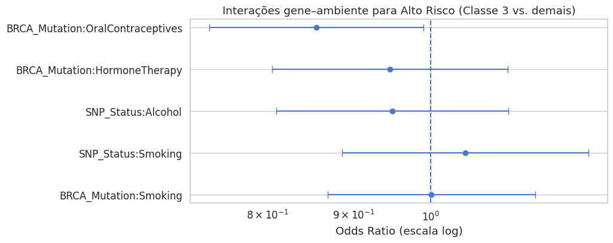

# Projeto: Uso de Contraceptivos Orais e Risco de Progressão do Câncer de Ovário em Portadoras da Mutação BRCA  

**Área Temática:** Patologia  
**Tema:** Interações gene–ambiente no câncer de ovário, com foco no efeito do uso de contraceptivos orais em mulheres portadoras da mutação BRCA.  

## Contexto  

O câncer de ovário é uma das neoplasias ginecológicas mais letais, em grande parte pelo diagnóstico tardio e ausência de métodos eficazes de rastreamento. Entre os determinantes de risco, destacam-se fatores genéticos (como mutações BRCA1/BRCA2) e hormonais/ambientais (uso de contraceptivos orais, hábitos de vida).  

Pesquisas sugerem que o uso prolongado de contraceptivos orais pode modificar o risco de progressão da doença, mas a magnitude e consistência dessa interação ainda são pouco exploradas em bases populacionais amplas.  

## Dataset  

**Nome:** *Ovarian Cancer Risk and Progression Data*  
**Origem:** Institute of Medical Data Processing, Biometrics, and Epidemiology (IBE) – LMU, Munique (2019–2024).  
**Registros:** 200.100 (dados horários).  
**Diversidade:** Pacientes de diferentes etnias, contextos socioeconômicos e ambientes (urbano e rural).  

### Estrutura do dataset:  
- **Clínicos:** idade, IMC, comorbidades, sintomas, níveis de CA-125, estágio do câncer, histopatologia, histórico de tratamento.  
- **Demográficos:** etnia, tabagismo, álcool, status socioeconômico, residência.  
- **Genéticos:** mutação BRCA, SNPs, expressão gênica, metilação de DNA, miRNA.  
- **Imagem:** tamanho e localização do tumor, radiômica, doppler.  
- **Reprodutivos/Hormonais:** paridade, uso de contraceptivos orais, menarca, menopausa, terapia hormonal.  
- **Alvo:**  
  - `Risk Label`: classificação em quatro categorias (0: sem risco → 3: alto risco).  
  - `Progression Probability`: probabilidade contínua de progressão (0–1).  

## Metodologia  

1. **Pré-processamento**  
   - Normalização e codificação de variáveis contínuas e categóricas.  
   - Estratificação por menopausa (pré x pós-menopausa).  

2. **Modelagem estatística e preditiva**  
   - Regressão logística multinomial e binária.  
   - Teste de interações gene–ambiente (BRCA x fatores hormonais e de estilo de vida).  

3. **Validação**  
   - Estimativas de odds ratio com intervalos de confiança de 95%.  
   - Análises estratificadas para verificar consistência dos achados.  

## Resultados  

- **Uso de contraceptivos orais em portadoras de BRCA:**  
  - Odds ratio = 0,855 (IC95%: 0,739–0,990, p = 0,037).  
  - Redução de ~15% no risco de progressão para alto risco.  

- **Estratificação menopausal:**  
  - Pré-menopausa → efeito não significativo.  
  - Pós-menopausa → tendência protetora consistente (OR = 0,850, p = 0,059).  

- **Outros fatores testados:**  
  - BRCA + tabagismo → sem associação significativa.  
  - BRCA + álcool → sem associação significativa.  

o efeito protetor dos contraceptivos orais é mais evidente em mulheres pós-menopausa com mutação BRCA.  
 
O gráfico abaixo mostra as interações gene–ambiente analisadas no estudo, destacando o efeito protetor do uso de contraceptivos orais:  

  

## Conclusão  

Este estudo evidencia que o uso de contraceptivos orais reduz significativamente o risco de progressão para estágios avançados do câncer de ovário em mulheres portadoras de mutação BRCA, sobretudo após a menopausa.  

Implicações práticas:  
- Apoiar aconselhamento genético individualizado.  
- Contribuir para estratégias de prevenção personalizadas.  
- Reforçar a importância de considerar fatores hormonais e históricos de vida reprodutiva em análises de risco oncológico.  

